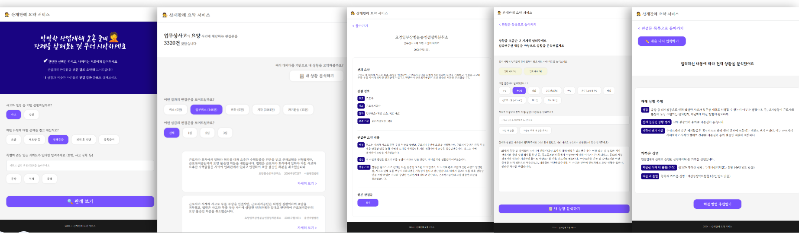
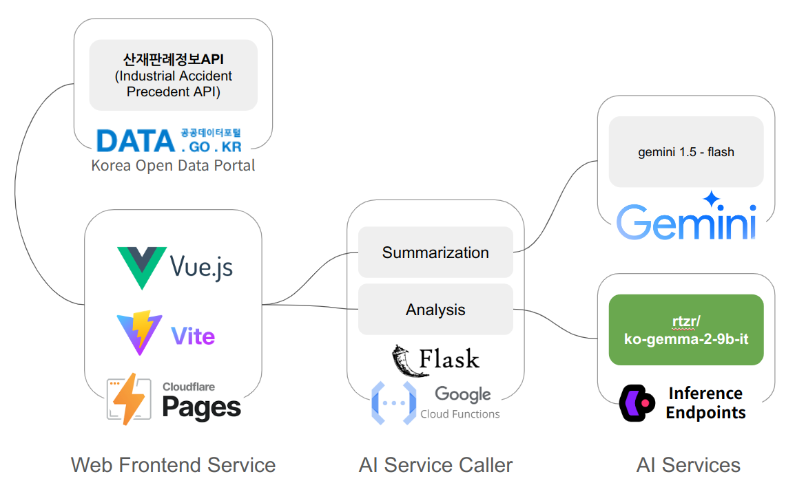

# sanjae-gemma

An industrial accident analysis service based on precedents related to industrial accident cases.

It aims to assist individuals who have been denied approval for their claims.

> - **Service URL**: [sanjae-gamma.wonj.in](https://sanjae-gemma.wonj.in.)
> - **Github Repo**: [sanjae-gamma](https://github.com/wonjinYi/sanjae-gemma)

# Gemma Sprint

Finally, the end of the 2024 Google Machine Learning Bootcamp is approaching. We are working on a project using the lightweight open source model gemma as the final step. Some people are creating new models through fine tuning, and some are creating tutorials for beginners. And We chose to develop an application.

# Backgrounds for App

In South Korea, there is a public insurance system called "산업재해보험 (Industrial Accident Insurance)." To receive benefits from this insurance, one must obtain approval for their industrial accident claim. However, inappropriate denials can sometimes occur, leaving the affected individuals in difficult situations. They often struggle to rectify these decisions and may feel lost, unsure of what steps to take next.

The primary users of this service are individuals involved in industrial accidents who are not experts in legal or labor matters. Our final goal is to support those in such situations by helping them take the first steps toward resolving their issues.

# The Goal of this sprint

The goal of this sprint is to use a Korean fine-tuned model based on gemma-2 to perform general-level situational inference. In the future, we plan to build training data using public data, deploy domain-specific models, and use them in services.

Now gemma-2 based model is used **partially** in the service (for Analysis Function, 내 상황 분석하기).

# Gemma Model

To implement the service, I used [rtzr/ko-gemma-2-9b-it](https://huggingface.co/rtzr/ko-gemma-2-9b-it), the model already fine-tuned to understand Korean.

If you need a tutorial on using this model, please refer to the colab below.

- [Colab: ko-gemma-2-9b-it_TEST_01Oct2024.ipynb](https://colab.research.google.com/drive/1ugUjPdKlObmix5puxVDAHoHv95YL6Ptf?usp=sharing)

# System Structure

### Web Frontend Service

This welcomes the user and initializes what is needed for the service.

It retrieves case data from the Korea Open Data Portal (공공데이터포털), classifies it for the purpose, extracts the necessary information, and turns it into usable data.

It then guides the user in two ways: one is to search for and summarize the relevant precedents and present them to the user; the other is to predict whether the user's case will be considered an industrial accident and present it to the user.

### AI Service Caller

The features provided by the frontend require the power of AI. There are simple flask-based servers as an intermediary for calling AI services. These servers run on GCP Cloud Function.

### AI Services

- User Cases Analysis :
  - As we have seen above, we use the gemma-2-9B-based model "rtzr/ko-gemma-2-9b-it" to infer whether the user's case corresponds to an industrial accident.
  - This model runs on "Inference Endpoints", a cloud-based managed inference service provided by Hugging Face.
  - It currently uses "Nvidia L40S (48GB)" provided by AWS.
- Precedents Summarization : Precedents is so long and complex that it can feel overwhelming. To make it easier and shorter, we use the Gemini API. This is called directly via the python package provided by Gemini (from AI Service Caller).

# Improvement opportunities

We initially aimed to replace all AI services with Gemma, but was unable to fully achieve that. Additionally, I sought to develop a fine-tuned Gemma-2 model specialized in law and labor, but obtaining or generating the necessary training data became a significant hurdle.

Building training data is a labor-intensive task, but it is something that must be done to create the model. I will find an appropriate way to build this data (which in itself will be highly meaningful), and eventually, we will deploy a Gemma-2 model that is well-suited to our service.
